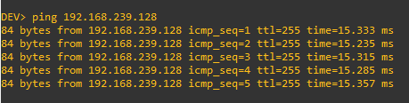
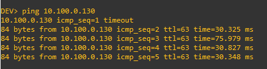
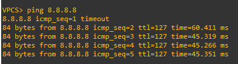
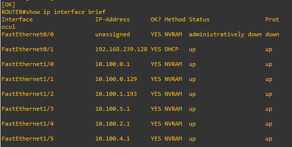

# Ada Projeto Redes - 1342

## Rede Principal

    Rede Principal: 10.100.0.0/20
    Máscara de Sub-rede: 255.255.240.0
    Total de Endereços: 4096 (de 10.100.0.0 a 10.100.15.255)

## Sub-redes para Cada Departamento

    TI: 100 hosts (com possibilidade de expansão futura)
        Sub-rede: 10.100.0.0/25
        Faixa de IP: 10.100.0.1 ~ 10.100.0.126
        Máscara de Sub-rede: 255.255.255.128
        Broadcast: 10.100.0.127
        Cálculo:
            Hosts Necessários: 100
            Hosts Disponíveis: 2^7 - 2 = 126 (2^7 = 128 endereços, menos 2 para rede e broadcast)

    Helpdesk: 120 hosts
        Sub-rede: 10.100.0.128/25
        Faixa de IP: 10.100.0.129 ~ 10.100.0.254
        Máscara de Sub-rede: 255.255.255.128
        Broadcast: 10.100.0.255
        Cálculo:
            Hosts Necessários: 120
            Hosts Disponíveis: 2^7 - 2 = 126

    Recursos Humanos (RH): 40 hosts
        Sub-rede: 10.100.1.0/26
        Faixa de IP: 10.100.1.193 ~ 10.100.1.254
        Máscara de Sub-rede: 255.255.255.192
        Broadcast: 10.100.1.255
        Cálculo:
            Hosts Necessários: 40
            Hosts Disponíveis: 2^6 - 2 = 62

    TEIA (Inovação): 50 hosts (expansão futura para 129)
        Sub-rede: 10.100.5.0/24
        Faixa de IP: 10.100.5.1 ~ 10.100.5.254
        Máscara de Sub-rede: 255.255.255.0
        Broadcast: 10.100.5.255
        Cálculo:
            Hosts Necessários: 50 (expansão para 129)
            Hosts Disponíveis: 2^8 - 2 = 254

    Sales: 300 hosts
        Sub-rede: 10.100.2.0/23
        Faixa de IP: 10.100.2.1 ~ 10.100.3.254
        Máscara de Sub-rede: 255.255.254.0
        Broadcast: 10.100.3.255
        Cálculo:
            Hosts Necessários: 300
            Hosts Disponíveis: 2^9 - 2 = 510

    GEPTI: 50 hosts
        Sub-rede: 10.100.4.0/26
        Faixa de IP: 10.100.4.1 ~ 10.100.4.62
        Máscara de Sub-rede: 255.255.255.192
        Broadcast: 10.100.4.63
        Cálculo:
            Hosts Necessários: 50
            Hosts Disponíveis: 2^6 - 2 = 62

### Testando conectividade entre Host e NAT

### Testando conectividade entre Host e Host (diferentes Switches)

### Testando conectividade com 8.8.8.8

### Mostrando os IPs definidos

Máscara:
- A máscara de sub-rede determina o tamanho da sub-rede e a quantidade de endereços IP disponíveis. Por exemplo, uma máscara de 255.255.255.128 (/25) permite 128 endereços IP, dos quais 126 são utilizáveis para hosts.

Broadcast:
- O endereço de broadcast é o último endereço de uma sub-rede e é usado para enviar pacotes a todos os dispositivos dessa sub-rede. Por exemplo, o endereço de broadcast para a sub-rede 10.100.0.0/25 é 10.100.0.127.

Sub-rede:
- Uma sub-rede é uma divisão lógica de uma rede IP maior. Sub-redes permitem uma melhor organização e gerenciamento de endereços IP, além de melhorar a segurança e o desempenho da rede.

Tércio Gabriel de Jesus - 2025
